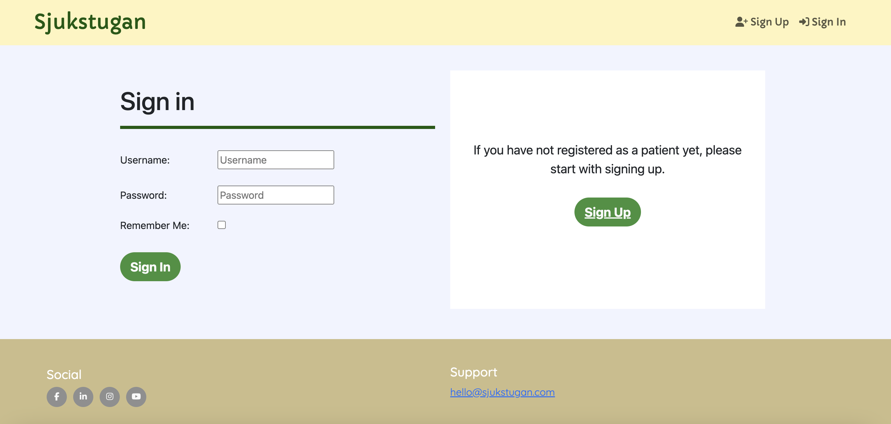

# june-hybrid-hackathon(team_1):

## Sjukstugan

.png)

## Features:

### The header:

The header is included on all pages with four navbar links to our pages which are the following:

* Sjukstugan(link to homepage)

* Sign Up

* Sign In

.png)

Once you have signed in to the page you can see the following:

* Sjukstugan(link to homepage)

* Book

* My Page

* Log Out


### The landing page image: 

Below the header the user can see a green welcome text with a simple and clean dark grey description text underneath it to give the user an easy and fast experience. To the right side of the welcome text and the description text the user can see a green heart image which is intended to match healthcare related experiences.

Below the landing page the user can find the about page which gives the user a view of a green about us text with a smaller dark grey description text underneath it. The description text tells the user about our story. On the left side of the about us text and description text the user can see a green briefcase image which is intended to match healthcare related experiences.

.png)

### Footer:

The footer is included on all four pages and contains all our social media platform links which are the following:

*Instagram

*Facebook

*Linkedin

*Youtube

The footer also includes an email address to our support.

.png)


### Book page:

This section can be found once you are logged in to the page and click on the navbar link "Book".

The bookin page gives the user the ability to mark the radio buttons of the time slots available for their appointment. The user also has to fill in the input field form where the need to explain the reason for the appointment.

Below the radio buttons and the input field the user will find a green button to book their time slot.


.png)

### My page:

When you are logged in you to the page you will be able to find navbar link "My page" which gives the user detils about their upcoming appointments and your personal details. You will also find a blue link as you can see on our image which can direct the users to the booking page.

.png)

### Sign in page:

This section can be found on the sign in page which gives the user an option to log in to their account.

The sign in form includes the following input fields:

* Username

* Password

And a checkbox button of: Remember Me.

Below the checkbox button the user can find the green sign in button. If the user hasn't siged up on the page yet then they will be able to do that on the right side as you can see on the image where it's a button that says sign up which will lead the user to a new page.



### The Sign up page:

The sign up form includes the following input fields:

* Username:

* Email:

* Password:

* Password(again):

* First name:

* Last name:

* Social security no:

* Phone no:

* Address

* Post code

* City

Below the input fields you can see a green sign up button. If the user already has an account on the page then they will be able to do that on the right side as you can see on the image where it's a button that says sign in which will lead the user to a new page.

.png)

### Log out page

When you are signed in to the page you will be able to sign out at the top right corner of the navbar links. We have added an extra page to for that function to make sure the user doesn't get signed out if they accidentially missclick that button.

The sign out page has a simple black title, with a text decoration line, a small text underneath it and a green sign out button.

.png)

### Overall info:

The website has colors and a design that our team feels matches or inspires the user experience of a swedish based healthcare business culture. The yellow colour is inspired from the swedish flag and the overall colours are inspired from healthcare related visual experiences:

The total colours are:

* Green

* Light yellow

* Dark yellow

* White

* Light grey

* Dark grey(Used on the small texts)

* Blue(Can be found on the links)

* Black

### Validator testing:

*The HTML and CSS code has been validated through:

*W3C Validator(HTML): https://validator.w3.org/nu/

*Jigsaw Validator(CSS): https://www.w3.org/

### Unfixed bugs or features to add in the futes:

* A function which cancels the appointment for the user.

* Adding an address to our headquaters.

### Structure

Paths:

- __/__ = homepage = index.html (template in users/templates)
  - The template gets passed the user object of the current user

- __/book-appointment__ = book-appointment.html (template in scheduling/templates/)
/patient = patient.html (template in users/templates)
  - user object of the current user: user
  - a list of time slot objects: object_list
  - has a crispy form: form (to create an appointment)
  - unauthorized users get redirected to homepage

- __/patient__ = patient.html (template in users/templates)

- __/accounts/signup__ = signup.html (template in .templates/account/)

- __/accounts/login__ = login.html (template in .templates/account/)

- __/accounts/logout__ = logout.html (template in .templates/account/)

### Deployment:

The program was deployed to [Heroku](https://id.heroku.com/login) and can be accessed by this [link](https://june-hackathon-f262315ded02.herokuapp.com/).

### To run the application locally:

*Note:*
1. This project requires you to have Python 3 installed on your computer.

2. In order to run the project you will need to install and run [virtualenv](https://packaging.python.org/en/latest/guides/installing-using-pip-and-virtual-environments/). This is due to compatibility issues between some versions of Python, such as 3.9.6 and the version of Python run on Heroku.

Create a local copy of the GitHub repository by following one of the two processes below:

- Download ZIP file:
  1. Go to the [GitHub Repository](https://github.com/johannacarolinep/june-hybrid-hackathon).
  2. Download the ZIP file containing the project.
  3. Extract the ZIP file to a location on your computer.

- Clone the repository:
  1. Run the following command in a terminal
  - `git clone git@github.com:johannacarolinep/june-hybrid-hackathon.git`

#### Create a SECRET_KEY
You will need to create a SECRET_KEY since Django requires this for cryptographic signing.

<details>
<summary>Click to open the instructions.</summary>
1. In the top-level directory of your project, create an *env.py* file.
2. Add *env.py* to *.gitignore*.
3. In *env.py* add *import os* at the top of the file.
4. Still in *env.py*, add the following line of code:
```python
os.environ.setdefault(
    "SECRET_KEY", "<your secret key>"
)
```
5. You can use an online key generator for your secret key value, such as [RandomKeygen](https://randomkeygen.com/)

</details>

#### Create and connect a PostgreSQL database to the project
To run the project, you will need to create and connect a PostgreSQL database instance. I used the [tool provided by Code Institute](https://dbs.ci-dbs.net/) for this, which is available to current Code Institute students.

<details>
<summary>Click to open the instructions</summary>

1. Go to [https://dbs.ci-dbs.net/](https://dbs.ci-dbs.net/).
2. Follow the on-screen instructions to create a database.
3. You should now have received an email containing the URL for your database.
4. In the *env.py* file of your project, add the following line of code:
```python
os.environ.setdefault(
    "DATABASE_URL", "<the URL for your database>"
)
```

</details>

<br>

Install the dependencies listed in *requirements.txt*. 

  - While in the project directory, run the following command in the terminal:

```
pip install -r requirements.txt
```

#### Run migrations
After completing the preceding steps, you should be able to migrate the models of the project to your database. 

In the terminal, run the following command:
```
python3 manage.py makemigrations
```

Followed by:
```
python3 manage.py migrate
```

#### Run the project locally
You should now be able to run the app locally by running the following command in the terminal:
```
python3 manage.py runserver
```

#### Create a superuser
Some functionality in the project, such as creating new recipes, is limited to superusers. Therefore, to access the admin panel, you will need to create a superuser.

Write the following command in the terminal:
```
python3 manage.py createsuperuser
```
Follow the instructions in the terminal, which will prompt you for an email and password.

### Run the project as a remote web application by deploying to Heroku:

<details>
<summary>Click to open the instructions</summary>

- Clone the repository:
  1. Create your own GitHub repository to host the code. You will need to host this code on your repository for the following to work.

  2. Run the command `git remote set-url origin <Your GitHub Repo Path>` to set the remote repository location to your repository.

  3. Ensure that the `DEBUG` constant is set to `True` in the *settings.py* file of the project.

  4. Before pushing the files to your repository, you need to correctly collect the static files of the repository to he `staticfiles` folder. In the terminal, run the commend `python3 manage.py collectstatic`.

  5. Push the files to your repository with the following command:
  `git push`
  
  6. Create a Heroku account if you don't already have one here [Heroku](https://dashboard.heroku.com).

  7. Create a new Heroku application on the [Heroku Apps page](https://dashboard.heroku.com/apps), by clicking "New" in the upper right corner, and selecting "Create new app":

  8. Name the app, choose a region, and click "Create app".

  9. Go to the Deploy tab:

  10. In the "Deployment method" section, click on "GitHub - Connect to GitHub". Search for your repository and connect your application.

  11. Next, go to the Settings tab:

  12. Next, in the "Config Vars" section, click "Reveal Config Vars". You will need to add config Vars

- Config Var number 1:
    - **Key:** DATABASE_URL **Value:** Copy the value of the DATABASE_URL constant in your *env.py* file and paste it here. 

- Config Var number 2:
    - **Key:** SECRET_KEY **Value:** You can use an online secret key generator to create a value for this config var. It's good practice not to use the same value as the SECRET_KEY constant in your *env.py* file.

  13. After adding the Config Vars, go back to the Deploy tab:

  14. In the "Manual deploy" section, click "Deploy Branch":

      - Wait for the completion of the deployment.

  15. You can now click the "View" button (in the screenshot above), to launch the application.

</details>


### Github steps

Merging your code into main:
1. Make sure you are on the main branch: check by running command `git branch`
  - If not on main branch, switch to main branch with `git checkout main`

2. Update your local main branch to mirror the live main branch, command: `git pull origin main`

3. Create a new branch: `git checkout -b <your branchname>`

4. Add your work

5. git add, commit, and push, using `git push origin <your branchname>`

6. Go to your repository on GitHub, and click to open a PR
  - If everything is green, share PR link with team

7. If PR is then merged to main, change from your local branch to your local main branch (following step 1).
  - Repeat process

If PR leads to conflicts:
1. In your local environment, switch to the main branch, `git checkout main`

2. Pull the latest version of main, with `git pull origin main`

3. Switch back to the branch you were working on, `git checkout <your branchname>`

4. Merge the new main into your local branch: `git merge main`

5. Now you should see a list of files that contain conflicts (if any). Time to fix the conflicts:
  - Review the files and manually edit the code.

6. Once all conflicts are resolved, add, commit and push changes to your branch, `git push origin <your branchname>`

7. Go to GitHub. You should now see a green tick on the PR.


### Credit:

All the codes was created by our team internally.

### Media:

* All the icons used in the code was taken from font awsome. Here is a url adress to their homepage: https://fontawesome.com/

* All the images was taken from: https://www.svgrepo.com/svg/383506/healthcare-heart


